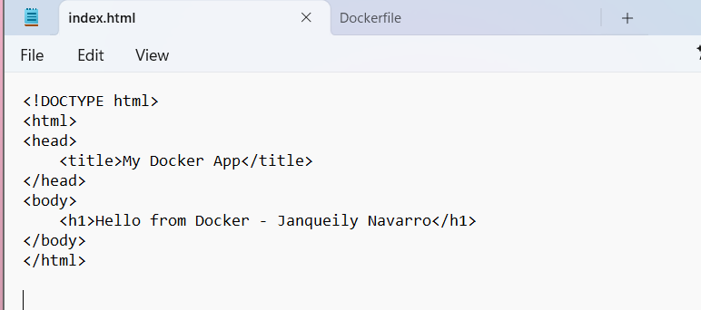
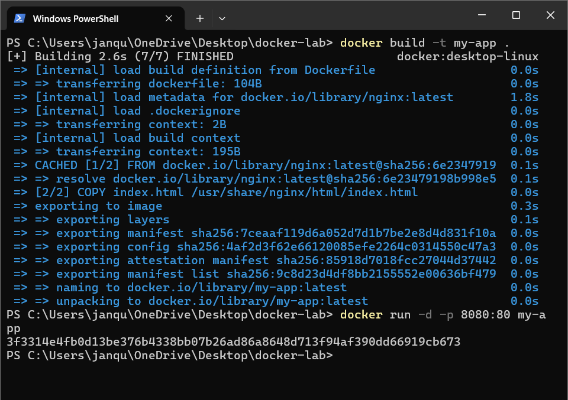
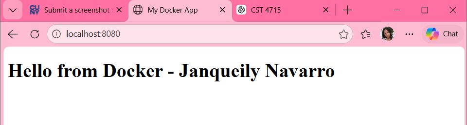

# Docker Containerized Web Application

## Overview

This lab was completed for CST 4715 as part of my Computer Systems coursework.

The goal was to build and run a simple web application inside a Docker container and verify that the application could be accessed through a web browser.

## What I Did

- Created a basic HTML web page
- Used an Nginx Docker image to host the page
- Built a custom Docker image named `my-app`
- Ran the container in detached mode
- Mapped host port `8080` to container port `80`
- Verified the application through `localhost:8080`

## Commands Used

```powershell
docker build -t my-app .
docker run -d -p 8080:80 my-app
```

## Result

The Docker image built successfully, the container started successfully, and the web application was accessible through the browser at `localhost:8080`.

## Screenshots

### HTML File
The HTML file used for the application displayed a simple heading identifying the Docker application.



### Docker Build and Container Run
The Docker image was built from the Dockerfile and the container was started with port `8080` mapped to port `80` inside the container.



### Application Running in Browser
The containerized application was successfully accessed through the browser at `localhost:8080`.



## Skills Practiced

- Docker
- Containerization
- Nginx
- Web application deployment
- Port mapping
- HTML
- Command-line administration
